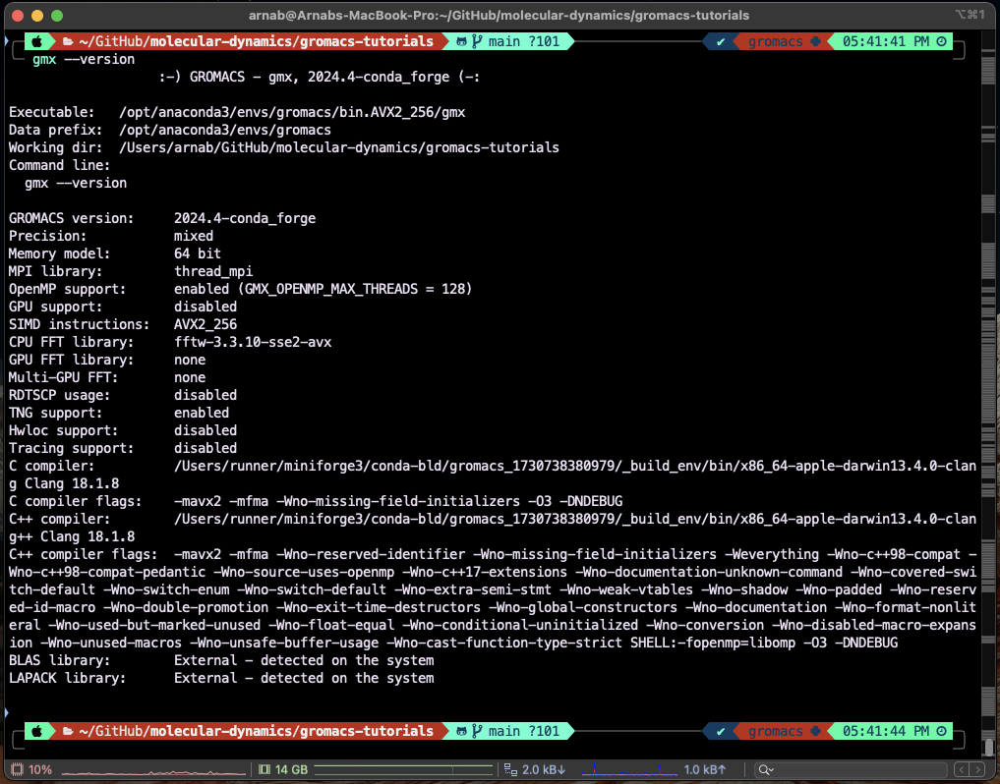

This is my attempt at learning gromacs from various tutorials. I will keep updating it as I progress. Currently going through the tutorials documented in mdtutorials.com website.

- Installing gromacs
  - cretae a conda environment with the command `conda create -n gromacs python=3.11`
  - activate the environment with `conda activate gromacs`
  - To install GROMACS `conda install -c conda-forge gromacs`
  - To verify the installation type `gmx --version`. This is what I see when I do this:

If we look at "OpenMP support" and "GPU support", it is clear that in my current machine I can run GROMACS in parallel, but I do not have GPU acceleration.

- Lysozome-water tutorial